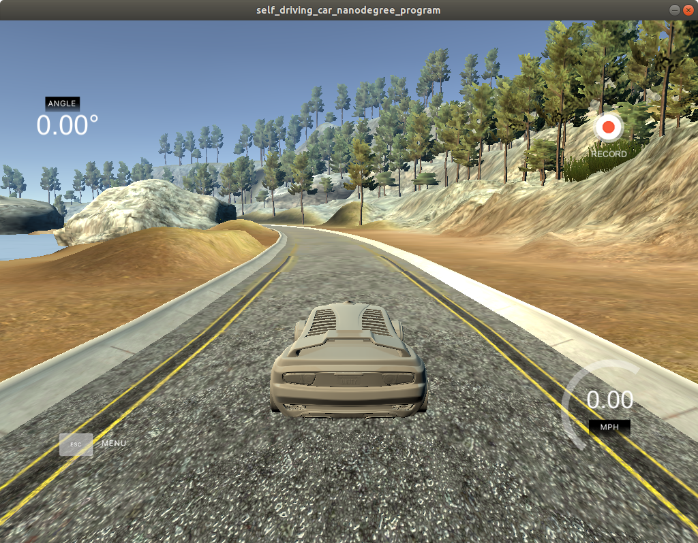
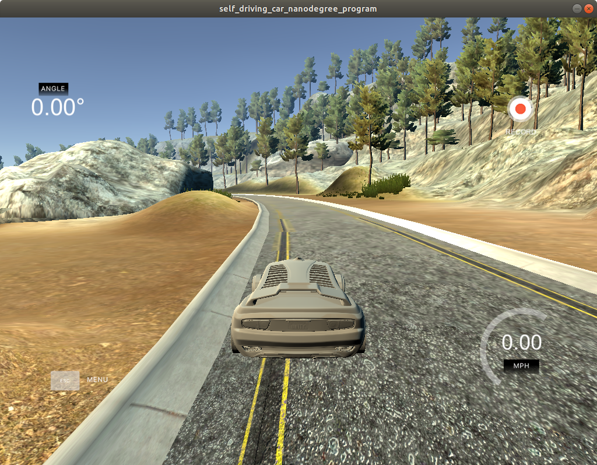
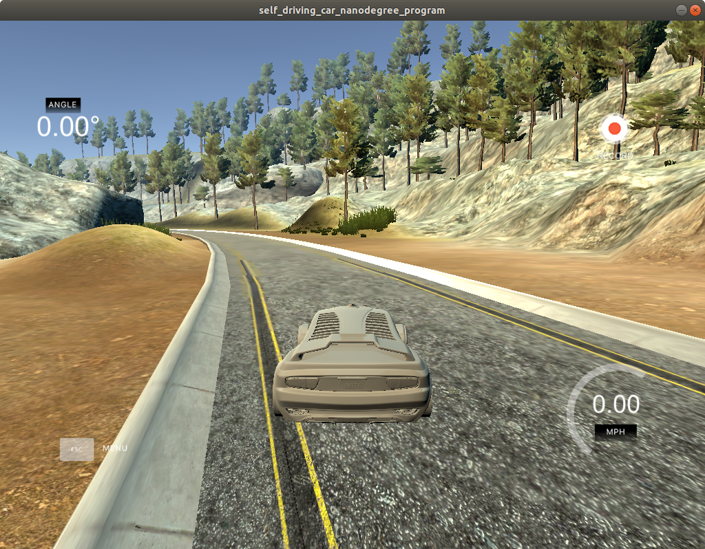

# **Behavioral Cloning**
---

**Behavioral Cloning Project**

The goals / steps of this project are the following:
* Use the simulator to collect data of good driving behavior
* Build, a convolution neural network in Keras that predicts steering angles from images
* Train and validate the model with a training and validation set
* Test that the model successfully drives around track one without leaving the road
* Summarize the results with a written report


[//]: # (Image References)

[image1]: ./examples/placeholder.png "Model Visualization"
[image2]: ./examples/placeholder.png "Grayscaling"
[image3]: ./examples/placeholder_small.png "Recovery Image"
[image4]: ./examples/placeholder_small.png "Recovery Image"
[image5]: ./examples/placeholder_small.png "Recovery Image"
[image6]: ./examples/placeholder_small.png "Normal Image"
[image7]: ./examples/placeholder_small.png "Flipped Image"

## Rubric Points
### Here I will consider the [rubric points](https://review.udacity.com/#!/rubrics/432/view) individually and describe how I addressed each point in my implementation.  

---
### Files Submitted & Code Quality

#### 1. Submission includes all required files and can be used to run the simulator in autonomous mode

My project includes the following files:
* model.py containing the script to create the model, and to act as a record for models I tried
* train.py containing the script to train the model
* drive.py for driving the car in autonomous mode
* nvidia_working.hdf5 containing a trained convolution neural network
* writeup_report.md summarizing the results

#### 2. Submission includes functional code
Using the Udacity provided simulator and my drive.py file, the car can be driven autonomously around the track by executing
```sh
python drive.py nvidia_working.hdf5
```

#### 3. Submission code is usable and readable


### Model Architecture and Training Strategy

#### 1. An appropriate model architecture has been employed

The model.py file contains the code for training and saving the convolution neural network. The file shows the different networks I tried in the process of this project, a LeNet inspired network, and Nvidia's self driving network.

The network starts with a transformation to the HSV color plane, to normalize the color information. then follows with BatchNormalization and cropping. The output of the "preprocessing" is then fed into a series of alternating 2D convolutional and dropout layers, after which it is flattened and fed into a series of alternating Dense and Dropout layers.

#### 2. Attempts to reduce overfitting in the model

The model contains dropout layers in order to reduce overfitting (model.py lines 112-130).

The dropout was added to the model after testing the base nvidia network and discovering that even with only about three laps around the track the model was overfitting. Every dropout layer has a value of 0.5, which is relatively high but improves the model significantly.

#### 3. Model parameter tuning

The model used an adam optimizer, so the learning rate was not tuned manually (model.py line 38).

#### 4. Appropriate training data

Training data was chosen to keep the vehicle driving on the road. I used two laps of center lane driving with smooth curves around the road, one in the reverse direction. In addition, I used between one and two laps around the road of recovery data, driving from the left and right sides of the road back to center.

### Model Architecture and Training Strategy

#### 1. Solution Design Approach

The overall strategy for deriving a model architecture was to use one that has been proven to work for a similar problem, and try to adapt it for this use case, making incremental changes and seeing if it improved the end result significantly. Tiny improvements were ignored as largely random.

My first step was to use a convolution neural network model similar to the nvidia model. I thought this model might be appropriate because it was a very similar problem to the one presented in this project, apart from the simulated nature of this project.

In order to gauge how well the model was working, I split my image and steering angle data into a training and validation set with a 80-20 split respectively. I included a checkpointer and early stopper into the model training process, and found that while the training loss was consistently going down, the validation loss would stop decreasing, indicating overfitting.

To combat the overfitting, I modified the model so that dropout layers were included between every convolutional and dense layer.

I also varied my data collection strategy to include a lap or two in the opposite direction, and augmented the training data by mirroring the output and reversing the steering angles.

The final step was to run the simulator to see how well the car was driving around track one. There were a few spots where the vehicle fell off the track, such as around the first sharp bend, immediately before the bridge, and onto the dirt road. To improve the driving behavior in these cases, I collected additional data around sharp turns, entering the bridge from both directions, and specifically the bend around the dirt road section.

At the end of the process, the vehicle is able to drive autonomously around the track without leaving the road.

#### 2. Final Model Architecture

The final model architecture (model.py lines 90) consisted of a convolution neural network with the following layers and layer sizes:

```python
dropout = 0.5
Lambda(to_hsv, input_shape=self.input_shape)

# normalize color channels
BatchNormalization()

# crop out the top bit
Cropping2D(cropping=((70, 25), (0,0)))

Conv2D(24, (5, 5), activation='relu', subsample=(2,2))
Dropout(dropout)
Conv2D(36, (5, 5), activation='relu', subsample=(2,2))
Dropout(dropout)
Conv2D(48, (5, 5), activation='relu', subsample=(2,2))
Dropout(dropout)
Conv2D(64, (3, 3), activation='relu', subsample=(1,1))
Dropout(dropout)
Conv2D(64, (3, 3), activation='relu', subsample=(1,1))

Flatten()
Dropout(0.25)

Dense(1164, activation='relu')
Dropout(dropout)
Dense(100, activation='relu')
Dropout(dropout)
Dense(50, activation='relu')
Dropout(dropout)
Dense(10, activation='relu')
Dense(1, activation='tanh')
```

Here is a visualization of the architecture, shown below:

||
|:---:|
|*Figure 1: Nvidia network*|

#### 3. Creation of the Training Set & Training Process

To capture good driving behavior, I first recorded two laps on track one using center lane driving. Here is an example image of center lane driving:

||
|:---:|
|*Figure 1: Center lane driving*|

I then recorded the vehicle recovering from the left side and right sides of the road back to center so that the vehicle would learn to .... These images show what a recovery looks like starting from ... :

||
|:---:|
|*Figure 1: Recovery begin*|

||
|:---:|
|*Figure 1: Recovery middle*|

||
|:---:|
|*Figure 1: Recovered*|


To augment the data sat, I also flipped images and angles thinking that this would significantly increase the amount of data available to the model

After the collection process, I had 9408 images representing data points. I then preprocessed this data by converting to the HSV color space, normalizing the color values to 0-1, then cropping out the top 70 and bottom 25 pixels.

I finally randomly shuffled the data set and put 10% of the data into a validation set.

I used this training data for training the model. The validation set helped determine if the model was over or under fitting. The ideal number of epochs was around 5-6, as validation loss stopped decreasing around this time. I used an adam optimizer so that manually training the learning rate wasn't necessary.
